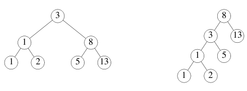
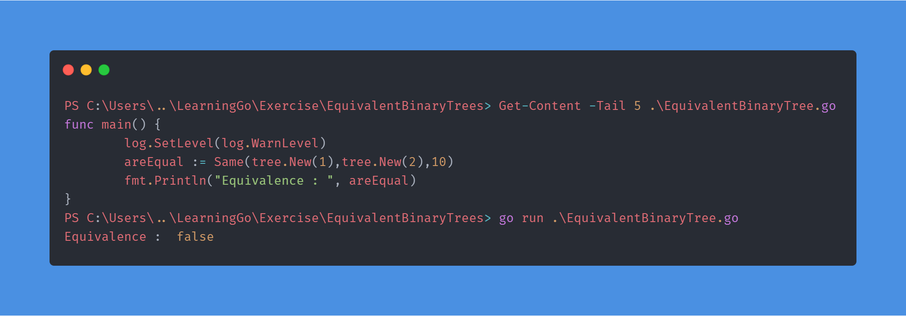
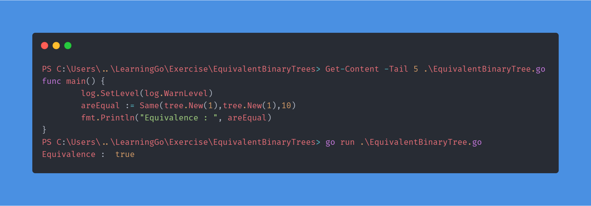

# Exercise: Equivalent Binary Trees
There can be many different binary trees with the same sequence of values stored in it.

For example, here are two binary trees storing the sequence 1, 1, 2, 3, 5, 8, 13.



A function to check whether two binary trees store the same sequence is quite complex in most languages. We'll use Go's concurrency and channels to write a simple solution.

This example uses the tree package, which defines the type:

```go
type Tree struct {
    Left  *Tree
    Value int
    Right *Tree
}
```
## ToDo
1. Implement the Walk function.
2. Test the Walk function.

The function `tree.New(k)` constructs a randomly-structured (but always sorted) binary tree holding the values k, 2k, 3k, ..., 10k.

Create a new channel ch and kick off the walker:

`go Walk(tree.New(1), ch)`
Then read and print 10 values from the channel. It should be the numbers 1, 2, 3, ..., 10.

3. Implement the `Same` function using `Walk` to determine whether t1 and t2 store the same values.

4. Test the Same function.

`Same(tree.New(1), tree.New(1))` should return true, and `Same(tree.New(1), tree.New(2))` should return false.

The documentation for Tree can be found [here](https://godoc.org/golang.org/x/tour/tree#Tree).

## Output




## Notes
I ended up implementing my own function `analyseTree(tree *tree.Tree,size int)(values []int)` 
that takes a tree, tree size and then calls the walk on the tree to find all values inside the tree
then after finding all the values, it sorts the channel values to be able to easily compare them

This made it easy to write the `Same()` function as now all it has to do it accept values from 
`analyseTree()` for the two trees and then just see if they all are same.