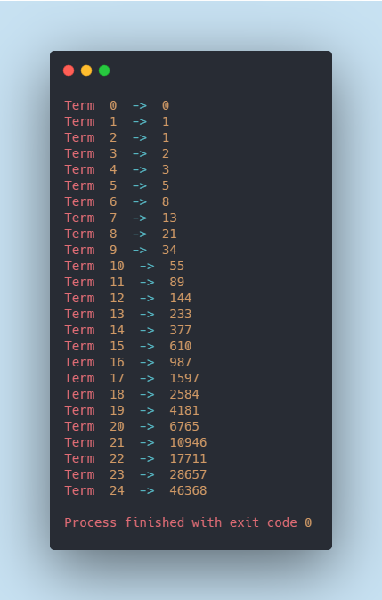

# Exercise: Fibonacci closure
Let's have some fun with functions.
- Implement a fibonacci function that returns a function (a closure) that returns successive fibonacci numbers (0, 1, 1, 2, 3, 5, ...).

## Note 
 We had to add a variable `oldA` to track the older value of variable `a` so that we could start the 
 sequence from 0 rather than starting from 1
 
 That is  `0,1,1,2,3,5,8,13,21,34,55,89,144`
 
 Instead of `1,1,2,3,5,8,13,21,34,55,89,144,233`
 
## Output
