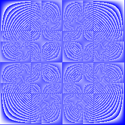

# Exercise: Slices
Implement Pic. It should return a slice of length `dy`, each element of which is a slice of `dx` 8-bit unsigned integers. When you run the program, it will display your picture, interpreting the integers as grayscale (well, bluescale) values.

The choice of image is up to you. Interesting functions include `(x+y)/2`, `x*y`, and` x^y`.

## Hints
1. You need to use a loop to allocate each []uint8 inside the [][]uint8.
2. Use uint8(intValue) to convert between types.

## Output

- Averaging the x and y positions gives us the image 

- Gradients in x and y directions generate the following image

- Raising x to power of y gives us the following image 

- Multiplying x and y to generate the image gives us a nice pattern 

- Changing the x and y values using left and right shifts and multiplying gives us
