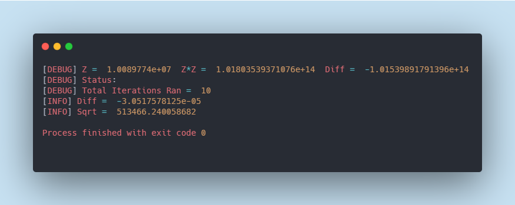

# Exercise: Loops and Functions
As a way to play with functions and loops, let's implement a square root function: 

**Given a number x, we want to find the number z for which z² is most nearly x.**

Computers typically compute the square root of x using a loop. Starting with some guess z, we can adjust z based on how close z² is to x, producing a better guess:
```go
z -= (z*z - x) / (2*z)
```
Repeating this adjustment makes the guess better and better until we reach an answer that is as close to the actual square root as can be.

Implement this in the func Sqrt provided. A decent starting guess for z is 1, no matter what the input. To begin with, repeat the calculation 10 times and print each z along the way. See how close you get to the answer for various values of x (1, 2, 3, ...) and how quickly the guess improves.

## Hint
To declare and initialize a floating point value, give it floating point syntax or use a conversion:

```go
z := 1.0
z := float64(1)
```

Next, change the loop condition to stop once the value has stopped changing (or only changes by a very small amount). See if that's more or fewer than 10 iterations. Try other initial guesses for z, like x, or x/2. How close are your function's results to the math.Sqrt in the standard library?

# Algo
If you are interested in the details of the algorithm, the z² − x above is how far away z² is from where it needs to be (x), and the division by 2z is the derivative of z², to scale how much we adjust z by how quickly z² is changing. This general approach is called Newton's method. It works well for many functions but especially well for square root.

## Output
