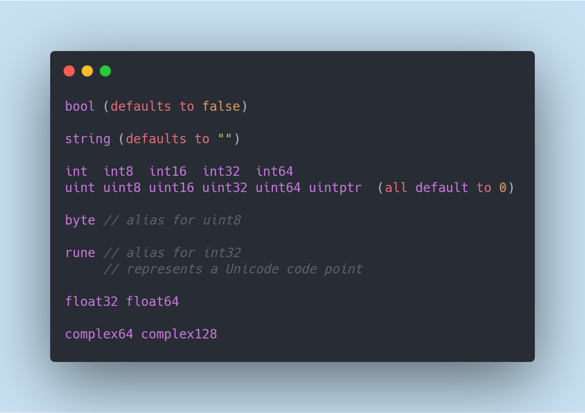

# Learning Go

Source [Tour of Go](https://tour.golang.org)

## Data types and default values

## Structure 

- [Hello World](HelloWorld/HelloWorld.go)
- [Basic IO](HelloWorld/BasicIO.go)

- ### Variables 
    - [Variable Data Types](Variables/DataTypes.go)
    - [Variable Declaration](Variables/InitAndShortVarDeclaration.go)
    - [Type Casting](Variables/TypeCasting.go)
    - [Variable Scopes](Variables/Vars.go)

- ### Functions
    - [Function Declaration](Functions/Add.go)
    - [Return Multiple Vals](Functions/Swap.go)
    - [Naked Return Values](Functions/NakedReturnValues.go)
    - [Defers](Functions/Defer.go)
    - [Stacked Defers](Functions/StackedDefers.go)
    - [Passing Functions as Arguments](Functions/PassingFunctionAsArgument.go)
    - [Function Closure](Functions/FunctionClosures.go)

- ### Conditionals
    - [If Else](Conditionals/IfElse.go)
    - [Switch Statement](Conditionals/Switch.go)
    - [Switch Without Conditions](Conditionals/SwitchWithoutConditions.go)
    
- ### Loops
    - [For Loop](Loops/ForLoop.go)
    - [While Loop](Loops/WhileLoop.go)
    
- ### Randoms
    - [Random Number Generator](Randoms/Random.go)
    - [Show Current Time](Randoms/Time.go)
    - [Go Logging](Randoms/BasicLogging.go)
    - [Logrus Logging](Randoms/LogrusLogging.go)
    
- ### Crypto
    - [SymmetricKey (AES-GCM)](Crypto/SymmetricKey)
    - [PublicKey (RSA)](Crypto/PublicKey)
    - [Elliptic Curve Diffie Hellman](Crypto/DiffieHellmanKeyExchangeECC)

- ### Concurrency
    - [Goroutine](Concurrency/Goroutine.go)
    - [BufferedChannels](Concurrency/BufferedChannels.go)
    - [Select](Concurrency/Select.go)

- ### Protobuf
    - [Protobuf as DataStore](Protobuf/protobuf-datastore)
    - [gRPC](Protobuf/gRPC)

# Data Structures
*Details about them are in their respective folders*
- [Arrays](DataTypes/Array)
- [Maps](DataTypes/Map)
- [Slices](DataTypes/Slice)
- [Struct](DataTypes/Struct)
- [Interface](DataTypes/Interface)

## Exercise Problems
- [Square Root](Exercise/SquareRoot)
- [Picture](Exercise/Pic-Slices)
- [WordCounter](Exercise/WordCount)
- [Fibonacci](Exercise/Fibonacci)
- [EquivalentBinaryTrees](Exercise/EquivalentBinaryTrees)
- [Rot13Reader](Exercise/Rot13Reader)
- [InfiniteReader](Exercise/Readers)
